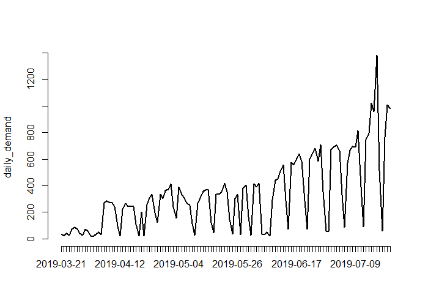
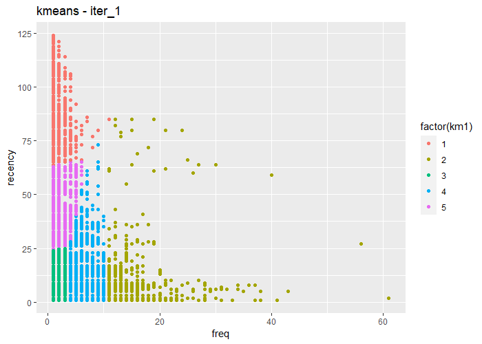
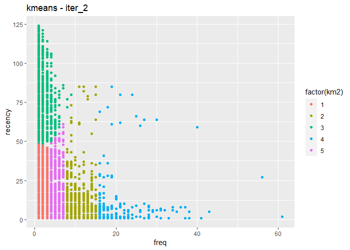
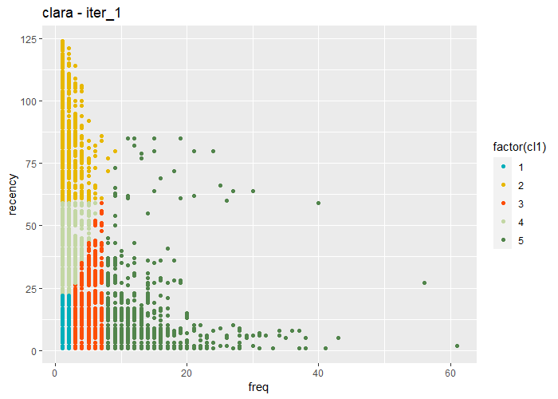
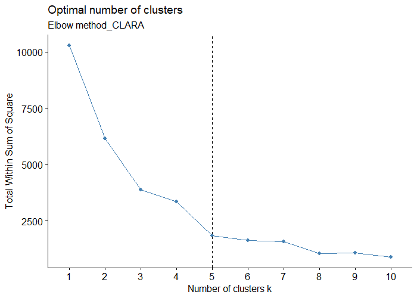
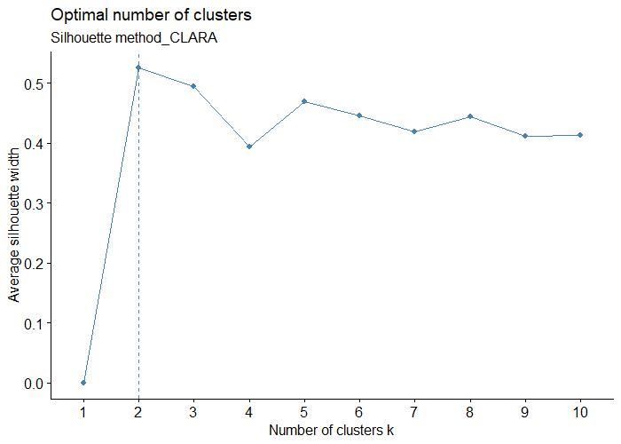
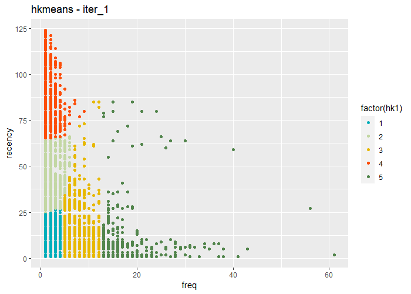
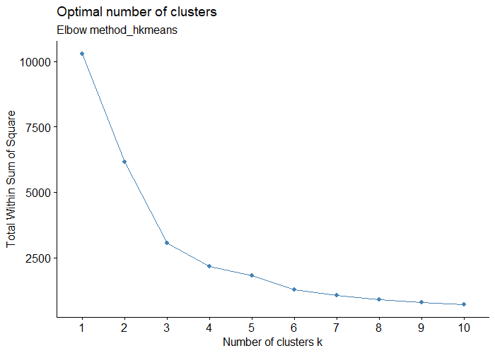
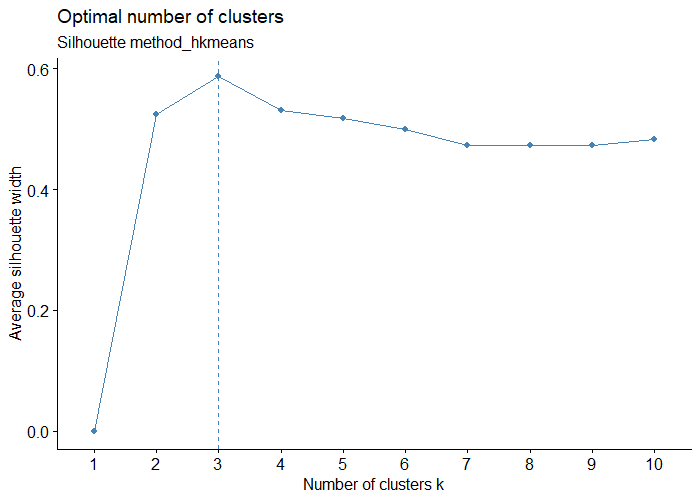

# R_CS_09
Clustering in R

### Case-Study Title: Customers RFM Clustering (Market Segmentation based on Behavioral Approach)
### Data Analysis methodology: CRISP-DM
### Dataset: Iranian online e-commerce platform's customers transactions data in first 4 months of year 1398 (from 1398/01/01 to 1398/04/31)
### Case Goal: Detect and Segment similar customers of e-commerce platform business (Customer Segmentation using RFM model)

Line chart of daily-demand of this Business

Result of first iteration of K-Means Clustering (5 Clusters)

Result of second iteration of K-Means Clustering (5 Clusters)

Result of first iteration of CLARA Clustering (5 Clusters)

Result of second iteration of CLARA Clustering (5 Clusters)

Optimal number of clusters for CLARA Clustering based-on Elbow method

Optimal number of clusters for CLARA Clustering based-on Silhouette method

Result of first iteration of Hierarchical-K-Means Clustering (5 Clusters)

Optimal number of clusters for Hierarchical-K-Means Clustering based-on Elbow method

Optimal number of clusters for Hierarchical-K-Means Clustering based-on Silhouette method

